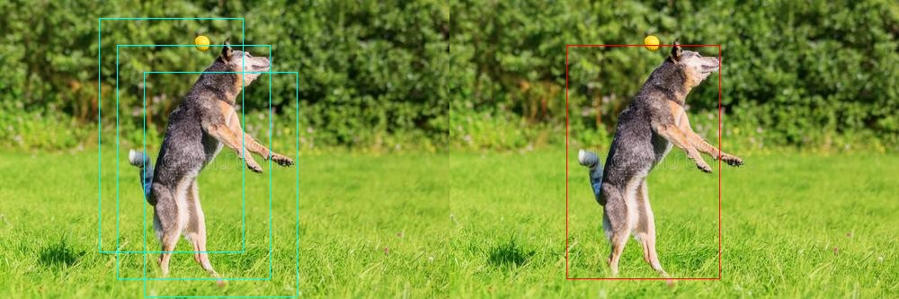

# Distance-IoU NMS using tensorflow and python

# Prerequisites
* tensorflow2.x

# test
```
python3 test.py
```
 


# References
* [Distance-IoU Loss: Faster and Better Learning for Bounding Box Regression](https://arxiv.org/pdf/1911.08287)


